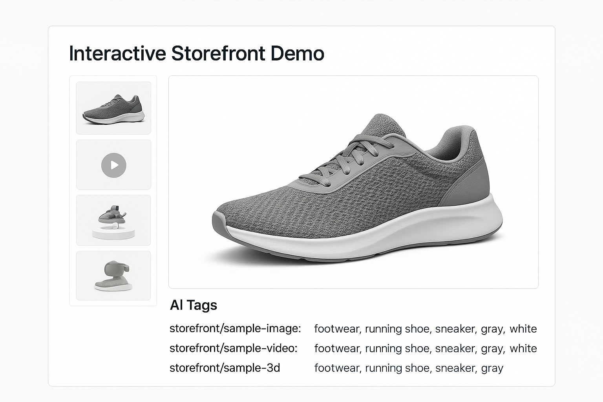

# ⚡ Power Your Next.js Storefront with Interactive Media and Smart AI Tagging Using Cloudinary



> A modern storefront demo showcasing Cloudinary’s Interactive Product Gallery (images, video, 360° & 3D) paired with AI-powered auto-tagging for smarter search, filtering, and personalization. 🚀

---

## ✨ Features

* 🖼️ **Interactive Product Gallery**: Showcase high-res images, videos, 360° spins, and 3D models
* 🤖 **AI Tagging**: Automatically categorize media with Cloudinary’s AI for smarter search, filters, and personalization
* 🎨 **Dynamic Layouts**: Responsive, mobile-first design with sleek thumbnail galleries and main viewers
* 🔒 **Secure Server Actions**: Sign Cloudinary URLs server-side for protected transformations
* ⚡ **Edge API Routes**: Lightning-fast routes for fetching tags and serving media

---

## 🛠️ Built With

[](https://nextjs.org/)
[](https://cloudinary.com/)
[](https://tailwindcss.com/)
[](https://ui.shadcn.com/)
[](https://motion.dev/)
[](https://axios-http.com/)

---

## 📚 Table of Contents

1. [Prerequisites](#prerequisites)
2. [Local Setup](#local-setup)
3. [Environment Variables](#environment-variables)
4. [Available Scripts](#available-scripts)
5. [Deploying](#deploying)
6. [Useful Links](#useful-links)

---

## ✅ Prerequisites

* **Node.js 18+** (tested on Node 20)

  ```bash
  nvm install 20 && nvm use 20
  ```
* A free [Cloudinary](https://cloudinary.com/) account:

  * Cloud Name
  * API Key & Secret

---

## 🚀 Local Setup

```bash
# 1. Clone the repo
git clone https://github.com/your-username/nextjs-cloudinary-storefront.git
cd nextjs-cloudinary-storefront

# 2. Install dependencies
npm install

# 3. Copy & configure .env
cp .env.example .env.local
# → Fill in your Cloudinary credentials

# 4. Run the development server
npm run dev
# → Open http://localhost:3000
```

---

## ⚙️ Environment Variables

Create a `.env.local` file with the following:

| Key                                 | Example             | Description                                  |
| ----------------------------------- | ------------------- | -------------------------------------------- |
| `NEXT_PUBLIC_CLOUDINARY_CLOUD_NAME` | `my-cloud`          | Public Cloudinary cloud name                 |
| `NEXT_PUBLIC_CLOUDINARY_FOLDER`     | `storefront-demo`   | (Optional) Folder for organizing your assets |
| `CLOUDINARY_API_KEY`                | `123456789012345`   | API Key (server-side only)                   |
| `CLOUDINARY_API_SECRET`             | `s0m3-sup3r-s3cr3t` | API Secret (server-side only)                |

> 🔒 **Never** commit `.env.local` or real secrets to source control.

---

## 📜 Available Scripts

| Command         | Description              |
| --------------- | ------------------------ |
| `npm run dev`   | Start development server |
| `npm run build` | Build for production     |
| `npm run start` | Launch production server |
| `npm run lint`  | Lint & type-check code   |

---

## 🌐 Deploying

Deploy on **Vercel** in seconds:

1. Push your repo to GitHub
2. Import the project in Vercel ([https://vercel.com/](https://vercel.com/))
3. Add the same environment variables
4. Click **Deploy** 🔥

Also compatible with Netlify, Render, and Cloudflare Pages—just set your env vars.

---

## 🔗 Useful Links

* 📘 [Interactive Product Gallery Docs](https://cloudinary.com/documentation/interactive_product_gallery)
* 📘 [AI Tagging & Categorization](https://cloudinary.com/documentation/auto-tagging)
* 📘 [Next.js App Directory Guide](https://nextjs.org/docs/app/getting-started/installation)
* 💫 [Motion.dev Quickstart](https://motion.dev/docs/react-quick-start)
* 🛠 [shadcn/ui Components](https://ui.shadcn.com/)

---

*Ready to showcase your products like never before? Let’s build!* 🎉
